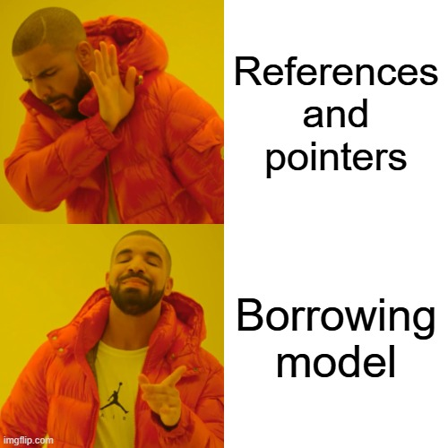

# Pourquoi faut-il passer à Rust ?

---


---
__*(Le vrai Rust)*__


---
## 1. Qu'est-ce que Rust ?

- Langage de programmation
- Dev applications, web, embarqué, ...
- Gestion de mémoire ultra optimisée
- Force les bonnes pratiques en Dev
- "Si ça compile, alors ça fonctionne"
---
## 2. Origines du Rust

- **Graydon Hoare**, dev chez **Mozilla**
- Grâce à un ascenseur mal développé
- Langages actuels = **difficultés pour la gestion de mémoire**
- Un but : **"améliorer" la gestion de mémoire de C/C++**
---
## 3. Les concepts spécifiques

Concepts importants et spécifiques à Rust :
- **Ownership model**
- **Move semantics**
- **Borrowing model**
---
### 4. Gestion de mémoire des autres langages
- Gestion de la mémoire manuellement
	- C/C++
- Gestion de la mémoire via le *Garbage Collector*
	- Java par exemple
---
Exemple du Garbage Collector en Java :
```java
public static void Main (String[] args) {
	private a = 1;
	private b = 2;
	a + b;
	System.gc();
}
```
---
#### 4.1 Le Garbage Collector
- Système de nettoyage de la mémoire
- Baisses de performances intermittentes
	- Mets en pause des threads
	- S'approprie de la mémoire
---
#### 4.2 La solution Rust : Ownership Model
- Chaque valeur appartient à sa variable/constante, et/ou instance
- **Compilateur** => Libération auto de la mémoire
	- A la sortie de la **scope (portée)**
- Préenregistrement des mouvements de mémoire
---
Système de propriété en Rust :
```rust
fn main() {
    // Ownership
    let user1 = String::from("Jean");
    //User1 : String = "Jean"
    //User1 est propriétaire de "Jean"
    
    // ✅ Rust compile, il n'y a pas d'erreur
    println!("{}", user1);
}
```
---
##### 4.2.1 Move semantics
- Mouvement de la propriété d'une valeur
- Évite l'allocation manuelle
- Évite les bugs de mémoire
---
Système de transfert en Rust :
```rust
fn main() {
    // Move Semantics
    let user1 = String::from("Jean");
    //User1 : String = "Jean"
    let jean = user1;
    // Transfert de la propriété de user1
    // Drop de user1 dans la mémoire
    println!("{}", user1);
    //❌ Propriété de user1 transférée à la variable jean
    println!("{}", jean);
    // ‼️ Le compilateur refuse de compiler ‼️
}
```
---
### 5. La gestion d'accès des autres langages
- Accorder un accès temporaire : références et pointeurs
	- => Manipulations dangereuses (ex : lecture et écriture concurrente)
	- Permet de facilement se tirer dans le pied
---
Est-ce que ce code marche au click de l'utilisateur ?
```java
public static void userClicked () {
	List<User> users = new arrayList<>();
	users.add(new User("Jerry"));
	users.add(new User("Bob"));
	users.add(new User("Tom"));
	for (User user : users) {
		if (user.getName().equals("Bob")) {
			users.remove(user);
		}
	}
}
```
---


---
```java
public static void userClicked () {
	List<User> users = new arrayList<>();
	users.add(new User("Jerry"));
	users.add(new User("Bob"));
	users.add(new User("Tom"));
	// On boucle sur 3 indexs
	for (User user : users) {
		if (user.getName().equals("Bob")) {
			// Mais on en enlève un
			users.remove(user);
			// Désynchronisation de l'itérateur
		}
	}
}
```
---


---
#### 5.1 La solution Rust : Borrowing model
- Emprunter (borrowing) ~= référence mais extrêmement rigoureuse
- Toujours rendre au compilateur
---
Exemple d'emprunt :
```rust
fn main() {
    let user1 = String::from("Jean");
    //User1 : String = "Jean"
    let jean = &user1;
    // La valeur de jean est une référence vers user1
    println!("{}", user1);
    println!("{}", jean);
    // ✅ Le compilateur fonctionne
}
```
---
##### 5.1.1 Les emprunts (borrowing)
- Immutables = aucun changement
- Mutables = changements possibles
- Référence mutable active -> pas de référence immutable vers celle-ci
- Plusieurs références immutables (même donnée) peuvent exister
- Une seule référence mutable peut exister
- La référence doit exister
---
```rust
// ❌ Référence immutable à une variable mutable

	// Variable mutable
    let mut nbr3 : i32 = 10;
    // Référence mutable
    let nbr4: &mut i32 = &mut nbr3;
    // Référence immutable
    let nbr5: &i32 = &nbr3;

    println!("{}", nbr4, nbr5);
    
    // ❌ Ne compile pas car il y a une concurrence
```
---
## Fin
Sources :
https://www.youtube.com/watch?v=hbHgIzIbzmQ
https://youtu.be/0y6RKiIk6cs
https://doc.rust-lang.org/


---