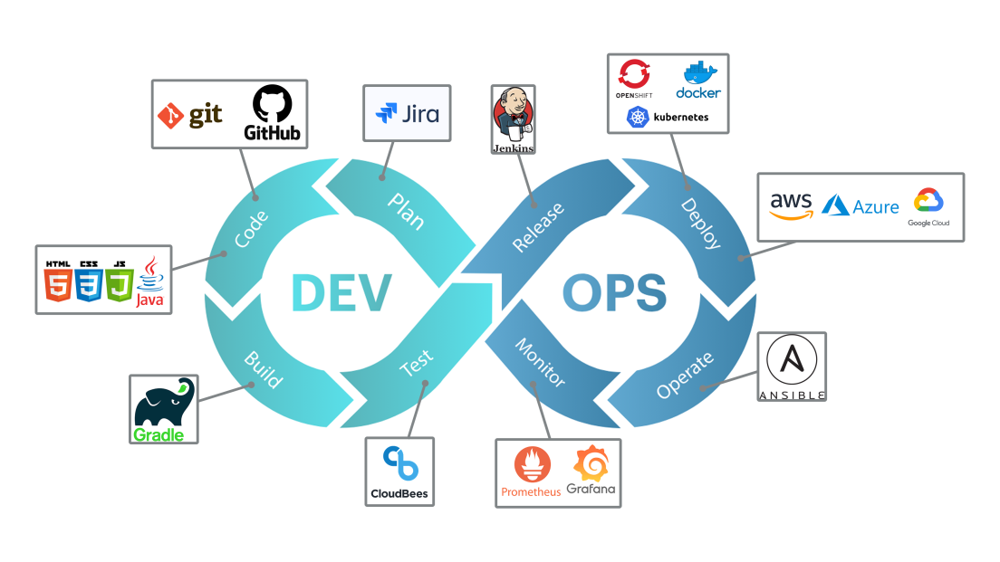
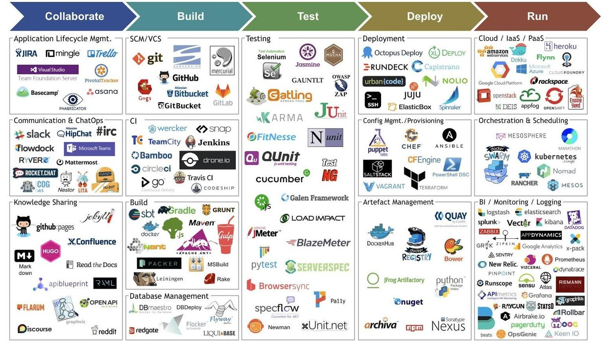
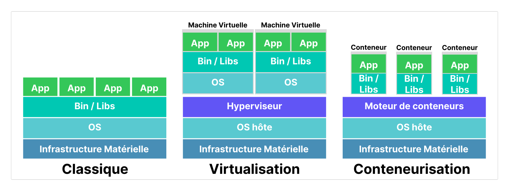

# Le DevOps
---
## Historique (avant 2007)

- Les équipes de **développement** et **opérationnelles (infrastructure/système)** avaient des objectifs distincts (souvent opposés).
- Elles avaient leur propre fonctionnement, leurs propres indicateurs de performance.
- Elles se préoccupaient de leur périmètre.
- Elles communiquaient rarement

=> Les équipes de **développement** et **opérationnelles** étaient cloisonnées.

---
## Historique (vers 2007)

La solution ? **DevOps**, qui comble le fossé entre ces équipes afin qu'elles travaillent de manière cohérente. La méthodologie rassemble les compétences, les processus et les outils des équipes de développement et opérationnelles.

---
## Qu'est ce que le DevOps
 
> [!important]
> **DevOps** :  Ensemble de **pratiques** et **d'outils**, ainsi qu'une **philosophie culturelle**.
> 
>  **But** : Automatiser et d'intégrer les processus entre les équipes de développement et opérationnelles. En mettant l'accent sur l'autonomisation des équipes, la communication et la collaboration transverses ainsi que l'automatisation technologique.

---
## Principes DevOps

- **Collaboration**
- **Automatisation**
- **Amélioration continue**
- ​​​​​​​**Action centrée sur le client**
- **Tenir compte de la finalité lors de la création**
---
## Le cycle DevOps

---
## Les Outils DevOps

---
## La notion de conteneurisation

--- 
## Avantages de la conteneurisation

- Portabilité
- Vitesse
- Évolutivité
- Agilité
- Efficacité
- Isolation
- Flexibilité
- Facilité de Gestion

---
## Les pipelines CI / CD

**CI** : Continuous Integration (Intégration Continue)
=> création, tests et fusion du code
**CD** : Continuous Deployment (Déploiement Continu)
=> déploiement automatique du code

> [!important]
> Un pipeline CI/CD est une série d'étapes automatisées et précises à réaliser en vue de la distribution d'une nouvelle version d'un logiciel

---
## Avantages des pipelines CI/CD

- Réduit les erreurs humaines
- Assure une cohérence pour la mise en production
- Minimise le temps entre la conception, les tests et les lancement
---
## Découverte Docker et Jenkins

[[Mini-Lab Docker et Jenkins]]

---  
## Conclusion

Le **DevOps** à été crée pour fluidifier le travail. L’idée est de mieux connecter les équipes de développement et les équipes opérationnelles pour livrer plus vite et garantir une meilleure qualité de code. En rapprochant ces deux métiers qui avançaient souvent chacun de leur côté, la chaîne logicielle devient un **cycle continu** plus réactif et plus efficace.

---
## Références :
https://www.atlassian.com/fr/devops
https://www.redhat.com/fr/topics/devops/what-cicd-pipeline

---
