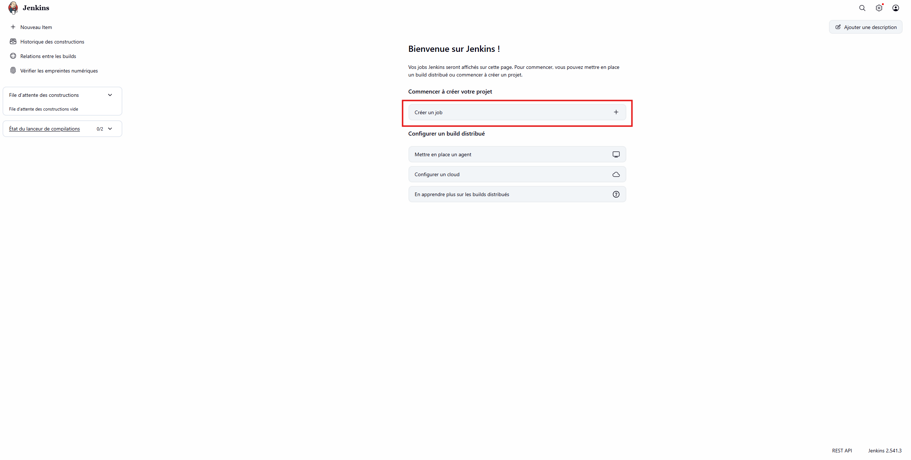
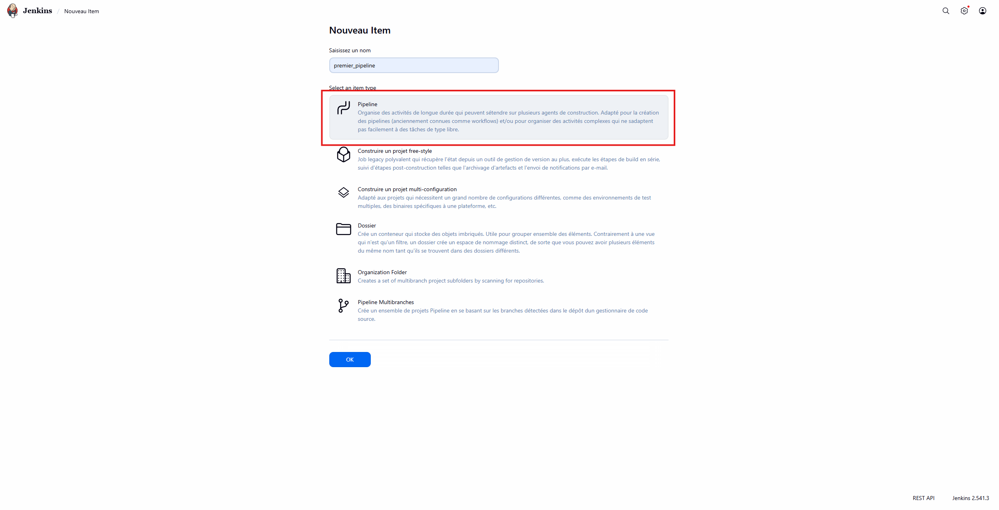
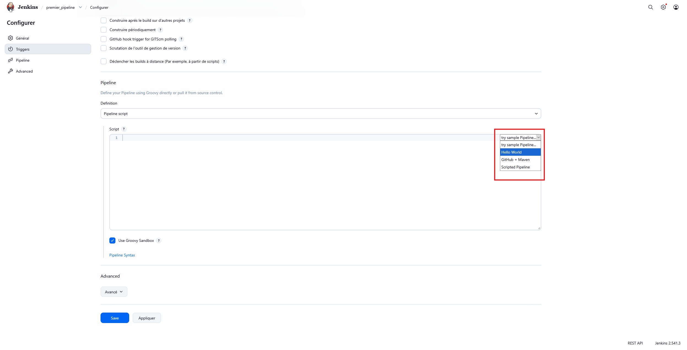
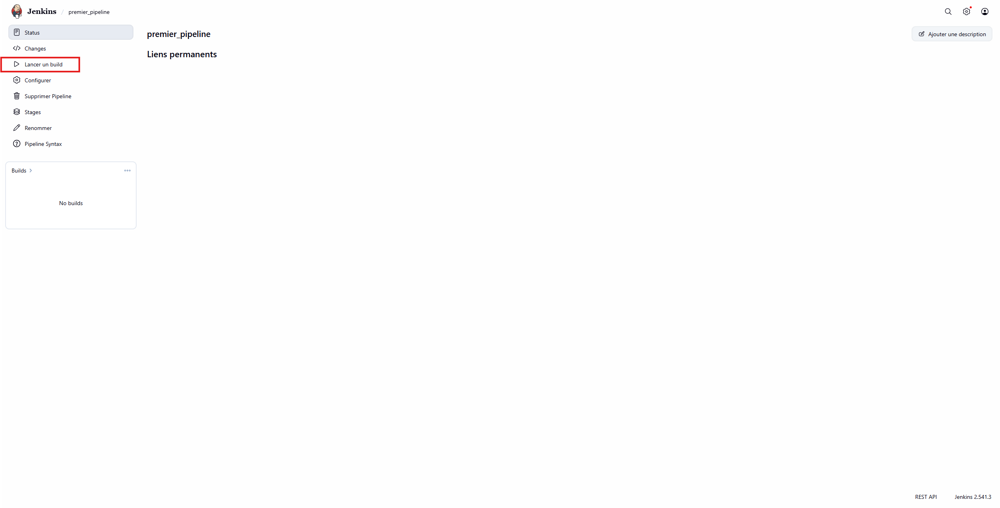

# Mini-Lab Docker et Jenkins

Bienvenue dans ce mini lab dédié à la découverte de Docker et Jenkins, ce document à pour vocation de reprendre tout ce que j'ai fait dans la veille du 01/04/2026 pour que vous puissiez manipuler Docker et Jenkins de votre côté

## Table des matières

[[#Création de votre Codespace]]
[[#Création de conteneurs Docker]]
[[#Manipulation de Jenkins]]
## Création de votre Codespace

Pour créer votre Codespace (environnement intégré à GitHub ayant une utilisation de 60h/mois dans la version gratuite de GitHub), veuillez vous rendre au [lien suivant](https://github.com/codespaces)

Vous pourrez alors cliquer sur <font style="color:green">New codespace</font> à droite puis relier votre codespace à un de vos repos

Vous voila maintenant sur un environnement hébergé par GitHub !

Pour vérifier que cet environnement possède bien docker, vous pouvez entrer la commande suivante :

```bash
docker --version
```

## Création de conteneurs Docker

Pour créer des conteneurs sur votre machine, il vous faut un <font style="color:lightblue">Dockerfile</font>,  ce fichier est l'équivalent de l'iso de votre système d'exploitation. Sans lui, il n'y a pas de conteneur.

### Commandes utiles

Afficher les conteneurs en cours d'exécution :

```bash
docker ps
```

Afficher tous les conteneurs (y compris ceux terminés) :

```bash
docker ps -a
```

Supprimer un conteneur :

```bash
docker rm <nom> ou docker rm <id>
```

Supprimer tous les conteneurs terminés :

```bash
docker rm $(docker ps -a -f status=exited -q)
```

Construire une image docker : 

```bash
docker build -t nom .
```

> [!tip]
> A noter, le `.` fait référence à l'emplacement de votre Dockerfile, si vous n'êtes dans un dossier parent il faudra préciser le dossier

Lancer votre conteneur à partir d'une image :

```bash
docker run --name nom_conteneur nom_image
```
### Conteneur Hello world

Le premier conteneur que vous allons créer est un conteneur Hello world, pour cela, vous aurez besoin de créer un dossier dans lequel figureront votre Dockerfile et votre fichier java

Dockerfile :

```Dockerfile
# Image de base contenant uniquement le JRE
FROM eclipse-temurin:21-jdk  

# Répertoire de travail à l'intérieur du conteneur
WORKDIR /app

# on copie le fichier Hello.java dans /app de notre conteneur
COPY Hello.java .

# on compile le programme java
RUN javac Hello.java

# commande exécutée au démarrage du conteneur
CMD ["java", "Hello"]
```

Fichier Java :

```java
public class Hello {

    public static void main(String[] args) {
        System.out.println("Hello from Docker!");
    }

}
```

Pour construire votre image docker : 

```bash
docker build -t hello-java .
```

Pour lancer votre conteneur à partir de l'image hello-java :

```bash
docker run --name hello-java-container hello-java
```


### Conteneur Nginx

Pour notre exemple, on ne va pas s'embêter à créer une image docker, on va donc prendre celle de base de Nginx en tapant la commande : 

Pour obtenir votre fichier jar, tapez la commande : 

```bash
docker run -p 8079:80 nginx
```

### Conteneur Jenkins

Pour notre exemple, on ne va pas s'embêter à créer une image docker, on va donc prendre celle de base de Jenkins en tapant la commande : 

```bash
docker run -d \
  --name jenkins \
  -p 8080:8080 \
  -p 50000:50000 \
  -v jenkins_home:/var/jenkins_home \
  jenkins/jenkins:lts
```

## Manipulation de Jenkins

Pour manipuler Jenkins, veuillez créer un [[#conteneur Jenkins]]

Avant de rentrer dans notre conteneur Jenkins pour la première fois, nous aurons besoin de récupérer le mot de passe de celui-ci, pour cela, exécutez la commande suivante :

```bash
docker exec -it jenkins cat /var/jenkins_home/secrets/initialAdminPassword
```

Vous pouvez maintenant aller dans l'onglet "Ports" de votre terminal, deux lien apparaiteront, cliquez sur celui du port 8080 et vous arriverez sur la page de base de Jenkins, qui vous demandera votre mot de passe, collez le ici.

Une fois votre mot de passe entré, Jenkins vous proposera de créer un utilisateur, entrez donc vos informations

### Job "Hello World"

Pour créer votre premier job, cliquez sur "Créer un job"


Saisissez ensuite le nom de votre job et sélectionnez "Pipeline"



Descendez jusqu'à arriver à "Script" et sélectionnez "Hello World" dans le menu déroulant de droite



 ou copiez ce script
 
```Jenkinsfile
pipeline {
    agent any

    stages {
        stage('Hello') {
            steps {
                echo 'Hello World'
            }
        }
    }
}
```

Une fois votre pipeline crée, cliquez sur "Lancer un build" en haut à gauche de l'écran



### Pipeline avec paramètres, stages et gestion d'erreur

Cliquez sur "Nouveau Item en haut à gauche" puis faites un pipeline du nom que vous souhaitez

Cochez "Ce build a des paramètres" et rentrez les paramètres suivants :

- Paramètre String :
	- Nom : A
	- Valeur par défaut : 5
	- Description : Valeur A
-  Paramètre String :
	- Nom : B
	- Valeur par défaut : 3
	- Description : Valeur B
-  Paramètre booléen :
	- Nom : DEPLOY
	- Valeur par défaut : cochez la case
	- Description : Déployer si les tests passent

Descendez ensuite dans Script et collez le script ci-dessous

```Jenkinsfile
pipeline {
    agent any

    parameters {
        string(name: 'A', defaultValue: '5', description: 'Valeur A')
        string(name: 'B', defaultValue: '3', description: 'Valeur B')
        booleanParam(name: 'DEPLOY', defaultValue: true, description: 'Déployer si les tests passent')
    }

    environment {
        VERSION = "2.0-demo"
    }

    stages {

        stage('Init') {
            steps {
                echo "Pipeline Démo"
                echo "Version : ${VERSION}"
                echo "Paramètres : A=${params.A}, B=${params.B}"
            }
        }

        stage('Dev') {
            steps {
                sh '''
                    echo "Calcul en cours"
                    a=${A}
                    b=${B}
                    c=$((a * b))
                    echo $c > result.txt
                    echo "Résultat = $c"
                '''
            }
        }

        stage('Tests') {
            parallel {
                stage('Test Unitaire') {
                    steps {
                        sh '''
                            res=$(cat result.txt)
                            echo "Test unitaire : res=$res"
                            if [ "$res" -gt 10 ]; then
                                echo "Test unitaire OK"
                            else
                                echo "Test unitaire KO"
                                exit 1
                            fi
                        '''
                    }
                }

                stage('Test Qualité') {
                    steps {
                        sh '''
                            echo "Analyse qualité..."
                            sleep 1
                            echo "Qualité OK"
                        '''
                    }
                }
            }
        }
        
        stage('Deploy') {
            when {
                expression { return params.DEPLOY }
            }
            steps {
                sh '''
                    echo "Déploiement fictif..."
                    sleep 1
                    echo "Déploiement terminé !" > deploy.log
                '''
            }
        }
    }

    post {
        success {
            echo "Pipeline terminé avec succès"
        }
        failure {
            echo "Pipeline en échec"
        }
    }
}

```

Une fois votre pipeline crée, cliquez sur "Lancer un build" en haut à gauche de l'écran


Vous pouvez laisser les valeurs par défaut, cela build car le test est passant !

Vous pouvez ensuite relancer un build avec comme valeur A = 2, et B = 3 par exemple, cela ne build pas car le test est KO !

Vous pouvez ensuite tester à nouveau en laissant les valeurs par défaut et en décochant la case deploy, si vous allez dans la vue détaillée en haut à droite vous voyez que l'étape de déploiement ne s'est pas lancée.
