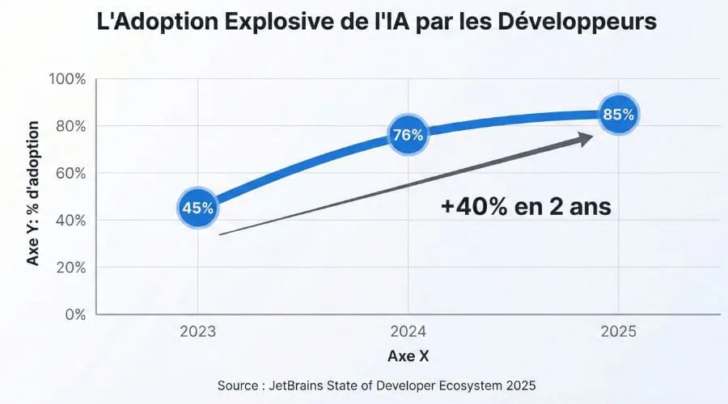
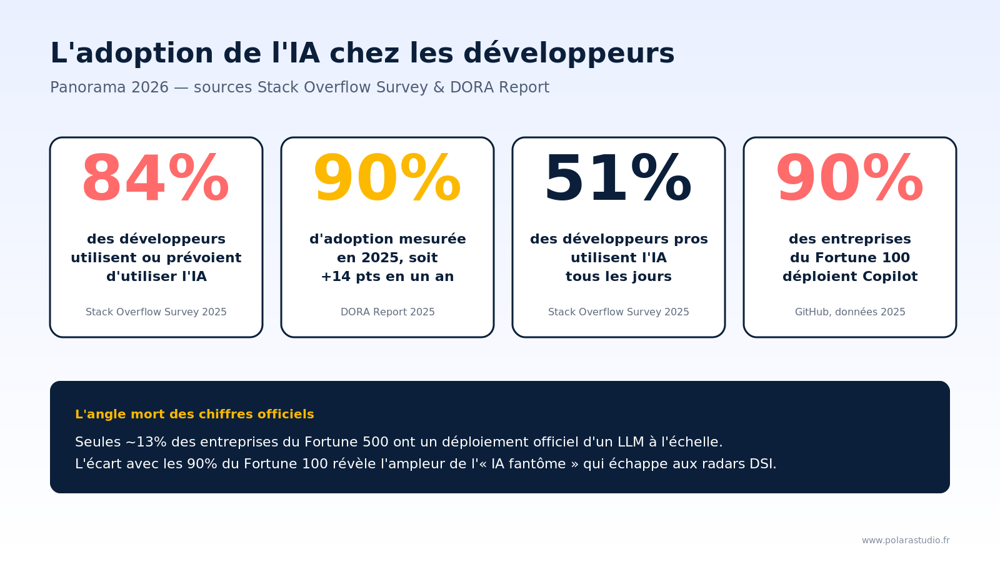
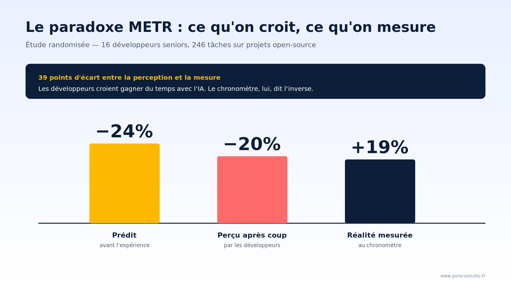
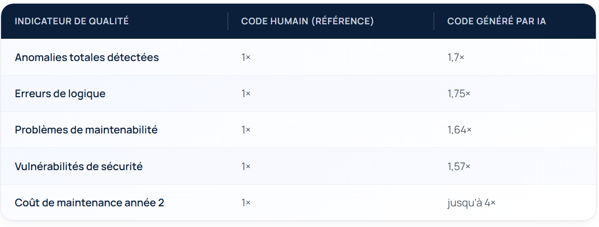

### IMPACT DE L'IA SUR LE MÉTIER DE DÉVELOPPEUR
---
Rôle du développeur change :

Avant : centré sur l'**écriture de code**
Après : rôle d'**orchestrateur de systèmes**

---
> [!warning] 
> Transformation qui s’accompagne de **risques techniques, organisationnels et éthiques**.

---
## Parlons chiffres

---

---

---
## Productivité : promesse vs réalité

----
Promesse :
- +35 % de productivité moyenne
- Code écrit plus rapidement
- Accélération du prototypage
----
En réalité :

**Les IA augmentent fortement la productivité… mais ne réduisent pas forcément le temps ou la complexité globale du travail.**

---

---
## Risques concrets en entreprise

---

---
## Impact sur les développeurs juniors
---
Effets négatifs :

- Apprentissage superficiel
- Moins d’effort cognitif
- Difficulté à comprendre le “pourquoi”

---
Chiffres :

- 61 % veulent comprendre leur code malgré l’IA
- Forte dépendance aux outils

Risque principal : Génération de développeurs “copilotes dépendants”

---
## IA dans les mutuelles et risques RGPD

---
Usage croissant :

- Automatisation des remboursements
- Analyse de dossiers médicaux
- Chatbots santé

---

> [!danger] 
> Données sensibles (santé = données critiques RGPD)
> Fuites de données via prompts (prompt leakage)
> Hébergement hors UE
> Manque de traçabilité des décisions

---
### CONCLUSION

---
## Transformation du métier de développeur

---
Le développeur devient :

➡️ **Architecte + contrôleur qualité + intégrateur**
➡️ L’IA ne remplace pas les développeurs  
➡️ Elle remplace **les développeurs qui ne s’adaptent pas**

---
La période 2026-2028 va punir la "vitesse aveugle" et récompenser les équipes qui utilisent l'IA comme un levier de qualité plutôt que comme un simple générateur de lignes de code.

---

Sources :
https://www.5degres.com/article/impact-ia-developpeur/
https://www.polarastudio.fr/blog/impact-ia-productivite-developpeurs-6-verites
https://survey.stackoverflow.co/2025/ai#1-ai-tools-in-the-development-process
https://www.contextstudios.ai/fr/blog/la-gueule-de-bois-du-vibe-coding-pourquoi-les-dveloppeurs-reviennent-la-rigueur-dingnierie