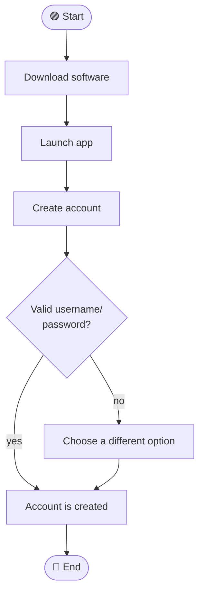

# Qu'est-ce qu'un cas d'utilisation ?

Dans le développement de logiciels, la conception de produits et d'autres domaines, un cas d'utilisation définit comment un système doit être utilisé pour atteindre des objectifs ou des tâches spécifiques. Il décrit les interactions entre les utilisateurs, ou acteurs, et le système en vue d'atteindre un résultat spécifique.

---

## Présentation des cas d'utilisation

Un cas d'utilisation est une description des différentes interactions d'un utilisateur avec un système ou un produit. Il définit les scénarios de réussite ou d'échec, ainsi que tout cas particulier ou exception importante. Un cas d'utilisation peut être rédigé ou visualisé à l'aide d'un outil de modèle de cas d'utilisation.

### Cas d'utilisation et user story, est-ce la même chose ?

Pas tout à fait. Bien que les cas d'utilisation et les user stories décrivent tous deux les interactions entre un utilisateur et un système, ce sont des outils différents avec des objectifs différents. Les user stories sont des phrases simples qui décrivent ce qu'un utilisateur souhaite accomplir.

> **Exemple :** « En tant qu'utilisateur, je veux me connecter à mon compte pour pouvoir visualiser mes commandes. »

Les analystes et les développeurs utilisent souvent ces deux outils à la fois. Les cas d'utilisation sont plus détaillés que les user stories. Ensemble, ils aident les équipes à comprendre comment créer des produits réussis.

---

## L'histoire des cas d'utilisation

L'informaticien suédois **Ivar Jacobson** a été le premier à écrire sur les cas d'utilisation en **1987**. Il décrivait la technique mise au point par Ericsson, une entreprise de télécommunications, pour capturer les exigences d'un système. En **1992**, il coécrit le livre *« Le génie logiciel orienté objet — une approche fondée sur les cas d'utilisation »*, qui a aidé à populariser les cas d'utilisation pour spécifier les exigences fonctionnelles dans le développement logiciel.

Jacobson collabore ensuite avec les ingénieurs en logiciel américains **Grady Booch** et **James Rumbaugh** pour donner naissance au **langage de modélisation unifié (UML)**, un langage de programmation qui a introduit une manière standard de visualiser la conception des systèmes. Depuis lors, la technique a été adaptée sous forme de « modèles » de rédaction de cas d'utilisation pour simplifier le recueil des exigences générales.

### Quelle est la finalité des cas d'utilisation ?

Les cas d'utilisation sont utiles pour :

- Gérer la portée d'un projet
- Définir les exigences d'un système
- Décrire les façons dont un utilisateur interagira avec le système
- Visualiser l'architecture du système
- Communiquer les exigences techniques aux équipes métier
- Gérer les risques

---

## Types de cas d'utilisation

### Le cas d'utilisation métier

Un cas d'utilisation métier décrit les principaux objectifs et interactions entre une entreprise et ses acteurs. Il se concentre sur les processus métier et aide les équipes à comprendre les objectifs de l'entreprise.

> **Exemple :** Dans le cadre du développement d'une appli mobile d'achat en ligne, un cas d'utilisation métier pourrait expliquer comment les utilisateurs recherchent des produits, les ajoutent à leurs paniers et effectuent des achats.

### Le cas d'utilisation d'un système

Ce type de cas d'utilisation décompose chaque étape de l'interaction entre l'utilisateur et le système, en définissant exactement ce qui se passe en arrière-plan. Il est très utile pour les développeurs car il décrit exactement comment le système doit fonctionner, avec des détails techniques sur la gestion des erreurs et l'expérience utilisateur.

### Le cas de test

Un cas de test vérifie si un utilisateur peut atteindre son objectif sans problème. Par exemple, si le cas d'utilisation implique qu'un client se connecte à son compte, le cas de test vérifiera :

- Le système accepte-t-il le nom d'utilisateur et le mot de passe corrects ?
- Affiche-t-il un message d'erreur si le mot de passe est incorrect ?

Ce type de cas d'utilisation est important pour garantir que le système fonctionne comme prévu et aide à détecter tout bug avant la mise en ligne du produit.

---

## Pourquoi les chefs de projet doivent-ils connaître les cas d'utilisation ?

Les chefs de projet ont tout intérêt à utiliser les cas d'utilisation pour communiquer la stratégie aux parties prenantes et combler le fossé entre la justification commerciale et les exigences techniques.

Les cas d'utilisation fournissent une structure pour la collecte des besoins clients et la définition du périmètre du projet. Ils permettent également aux utilisateurs finaux de « tester » le système dès sa conception, ce qui accélère le développement et améliore l'ergonomie.

En résumé, les cas d'utilisation permettent de :

- Permettre aux clients professionnels d'exprimer leurs besoins
- Faciliter la communication entre les services commerciaux et informatiques
- Réaliser des tests basés sur les exigences et des scénarios de tests d'acceptation utilisateur
- Assurer une gestion structurée des exceptions
- Définir les modifications et les messages
- Obtenir une définition des exigences plus complète et plus rapide

---

## Comment rédiger un cas d'utilisation pour un projet

Un cas d'utilisation doit contenir les éléments clés suivants :

| Élément | Description |
|---|---|
| **Système** | Un produit, un service ou un logiciel |
| **Objectif** | Ce que le cas d'utilisation vise à atteindre |
| **Pré-conditions** | Conditions requises avant l'exécution |
| **Acteurs** | Utilisateur ou tout autre élément interagissant avec le système |
| **Flux de base** | La séquence d'actions idéale (chemin principal) |
| **Scénario** | Séquence spécifique d'actions et d'interactions |
| **Cas d'utilisation** | Scénarios de succès et d'échec |
| **Post-conditions** | Situation du système et des acteurs à la fin |

> Il y a quatre types d'acteurs : système, acteur interne, **acteur principal** et **acteur secondaire**. L'acteur principal initie l'interaction avec le système, tandis que l'acteur secondaire peut fournir un service au système.

### Exemple simple : appli de livraison de repas

| Élément | Détail |
|---|---|
| **Système** | Application de livraison de repas |
| **Acteur principal** | Client commandant un repas |
| **Scénario** | L'utilisateur parcourt les options de restaurants, passe une commande, paie en ligne ou en personne. La commande est envoyée au système interne du restaurant. L'employé reçoit et traite la commande électronique. |

Ce cas d'utilisation illustre comment le client et l'employé du restaurant interagissent tous les deux avec l'application, et décrit le résultat attendu de chaque interaction.

---

## Qu'est-ce qu'un modèle de cas d'utilisation ?

Un modèle de cas d'utilisation est une **représentation visuelle** des interactions entre un acteur et un système. Les modèles utilisent généralement le langage **UML** et se composent de trois éléments principaux :

- **Le système** : représenté par un rectangle (« cadre de limite »)
- **Les acteurs** : représentés par des personnages stylisés à l'extérieur du cadre
- **Les cas d'utilisation** : représentés par du texte dans des figures ovales, à l'intérieur du cadre

Les lignes pleines et pointillées représentent le lien entre les acteurs et les cas d'utilisation du système.

---

## Quelle est la différence entre un modèle de cas d'utilisation et un diagramme de cas d'utilisation ?

Un **diagramme de cas d'utilisation** est un type de modèle de cas d'utilisation. Il utilise du texte et des formes pour représenter les interactions entre un utilisateur et un système.

Les diagrammes de modèles de cas d'utilisation sont principalement utilisés pour :

- Visualiser le flux et le comportement du système
- Illustrer la fonctionnalité du système
- Représenter les interactions clés des utilisateurs du système

Selon le système, un diagramme peut être plus ou moins complexe, avec des liens plus ou moins simples pour illustrer différents cas.

