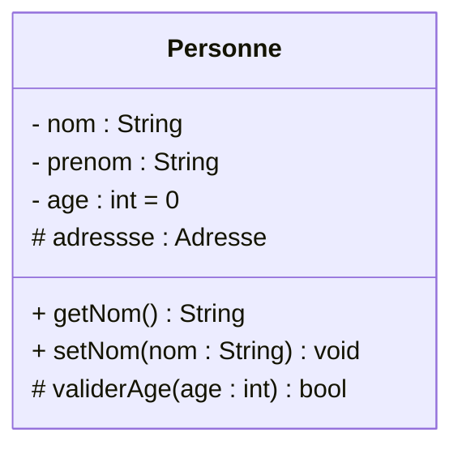

# Présentation
Les diagrammes de classes sont l'un des types de diagrammes UML (langage de modélisation unifié) les plus utiles, car ils décrivent clairement la structure d’un système particulier en modélisant ses classes, ses attributs, ses opérations et les relations entre ses objets.

# Les avantages
Les diagrammes de classes présentent de nombreux avantages pour n'importe quel type d'organisation. On peut les utiliser pour :
- Illustrer des modèles de données pour des systèmes d’information, quel que soit leur degré de complexité.
- Mieux comprendre l’aperçu général des schémas d’une application.
- Exprimer visuellement les besoins d'un système et partager cette information dans toute l'entreprise.
- Créer des schémas détaillés qui mettent l'accent sur le code spécifique qui doit être programmé et mis en œuvre dans la structure décrite.
- Fournir une description indépendante de l'implémentation des types utilisés dans un système, qui sont ensuite transmis entre ses composants.
# Composants de base
Le diagramme de classes standard est composé de trois sections :

- **Section supérieure** : contient le nom de la classe. Cette section est toujours nécessaire, que l'on parle du classifieur ou d'un objet.
- **Section intermédiaire** : contient les attributs de la classe. On l'utilise pour décrire les qualités de la classe. Elle n'est nécessaire que lors de la description d'une instance spécifique d'une classe.
-  **Section inférieure** : contient les opérations de la classe (méthodes), affichées sous forme de liste. Chaque opération occupe sa propre ligne. Les opérations décrivent la manière dont une classe interagit avec les données.
```
┌─────────────────────┐
│   NomClasse         │ ← Nom de la classe
├─────────────────────┤
│ - attributPrive     │ ← Attributs (avec modificateurs)
│ # attributProtege   │
│ + attributPublic    │
├─────────────────────┤
│ + methodePublic()   │ ← Méthodes
│ - methodePrivee()   │
│ + getAttribut()     │
└─────────────────────┘
```
## Nom de la classe
Il est écrit dans le rectangle du haut.
## Attributs 
Pour définir un attribut la syntaxe est la suivante :
`Visibilté nomAttribut : typeAttribut[multiplicité] = Initialisation`
### Visibilité
La notion de visibilité indique qui peut avoir accès à l'attribut.
Elle peut prendre les valeurs suivantes :

| Caractère | Mot clé   | Description                                                                          |
| --------- | --------- | ------------------------------------------------------------------------------------ |
| +         | public    | Toutes les autres classes ont accès à cet attribut                                   |
| #         | protected | Seules la classe elle-même et les classes filles (héritage) ont accès à cet attribut |
| ~         | package   | Classe visible uniquement dans le package (par défaut)                               |
| -         | private   | Seule la classe elle-même a accès à cet attribut                                     |
Afin de respecter le principe fondamental d'encapsulation, tous les attributs devraient être ***private***.

Pour qu'un attribut private ou protected soit récupérable, on utilise un getter (ou accesseur), et pour le modifier on utilise un setter (ou mutateur).

### Nom
Le nom ne doit pas comporter d'espaces, de signes de ponctuation ou d'accents. Pour remplacer les espaces, plusieurs conventions existent : on peut intercaler un symbole _ entre les mots ou utiliser la méthode CamelCase qui consiste à mettre la première lettre de chaque mot en capitale (par exemple, _nom de l'objet_ peut devenir : _nom_objet_ ou _NomObjet_).
### Multiplicité
La multiplicité représente le nombre de fois où la variable peut intervenir. Elle est représentée entre crochets.
Par exemple, si une personne possède deux numéros de téléphone, on préfèrera `noTelephones [2]` à `noTelephone1` et `noTelephone2`.

## Méthodes
Elles apparaissent dans le rectangle du bas. 
Le format général d'une méthode est 
`visibilité nom(param1 : type, param2 : type) : typeRetour`
**Exemple complet :**

### Stéréotypes et modificateurs spéciaux

| Notation          | Modificateur   | Signification                                              |
| ----------------- | -------------- | ---------------------------------------------------------- |
| {static}          | static/class   | Appartient à la classe, pas à l'instance (souligné en UML) |
| {abstratc}        | abstract       | Méthode sans implémentation, doit être redéfinie           |
| {readOnly}        | final / const  | Attribut non modifiable après initialisation               |
| {ordered}         | ordered        | Collection dont l'ordre est significatif                   |
| `<<interface>>`   | interface      | Stéréotype indiquant une interface                         |
| `<<abstract>>`    | abstratc class | Classe abstraite (ne peut pas être instanciée)             |
| `<<enumeration>>` | enum           | Type énuméré avec valeurs fixes                            |
# Les relations entre les classes
Les relations sont le cœur du diagramme de classe. Elles décrivent comment les classes interagissent et dépendent les unes des autres. Il existe six types principaux de relations, chacun avec une signification et une notation précises.

|Type de liaison|Symbole UML|Description|Exemple|
|---|---|---|---|
|Association|`A ─────── B`|Relation générale entre deux classes|Un Client passe des Commandes|
|Agrégation|`A ◇────── B`|« A un » : B peut exister sans A _(losange creux)_|Une Équipe a des Joueurs|
|Composition|`A ◆────── B`|« Est composé de » : B ne peut exister sans A _(losange plein)_|Une Maison a des Pièces|
|Héritage|`A ──────△ B`|« Est un » : A est une spécialisation de B _(triangle creux)_|Chien hérite d'Animal|
|Réalisation|`A - - - △ B`|A implémente l'interface B _(pointillés + triangle creux)_|ArrayList réalise List|
|Dépendance|`A - - --> B`|A utilise B temporairement _(relation faible)_|Voiture dépend de Carburant|

## Association
C'est la relation la plus courante. Elle indique qu'un objet d'une classe « connaît » ou « utilise » un objet d'une autre classe.

```
  Client ──────────────── Commande
           1        0..*
  (un client passe zéro ou plusieurs commandes)
```

> [!INFO]
> Une association peut être **nommée**, **navigable** dans un sens ou les deux, et dispose de **multiplicités** aux deux extrémités.
## Les multiplicités
Les multiplicités indiquent le **nombre d'instances** impliquées dans une relation :

|Notation|Signification|
|---|---|
|`1`|Exactement un (obligatoire)|
|`0..1`|Zéro ou un (optionnel)|
|`*` ou `0..*`|Zéro ou plusieurs (aucune limite)|
|`1..*`|Un ou plusieurs (au moins un)|
|`n..m`|Entre n et m (ex : `2..5`)|
|`3`|Exactement 3|

## Agrégation vs Composition
Ces deux relations expriment un lien **tout / partie**, mais avec des degrés différents de dépendance :

```
AGRÉGATION (losange creux) :
Equipe ◇────────── Joueur
        1       0..*
→ Si l'Équipe est dissoute, les Joueurs continuent d'exister.

COMPOSITION (losange plein) :
Maison ◆────────── Piece
        1       1..*
→ Si la Maison est détruite, les Pièces n'existent plus.
```

## Héritage (Généralisation)
L'héritage modélise la relation **« est un »**. La classe enfant hérite de tous les attributs et méthodes de la classe parente, et peut en ajouter ou en redéfinir.

```
         Animal
        △  (triangle creux, côté parent)
        │
  ┌─────┴──────┐
  │            │
Chien         Chat

→ Chien « est un » Animal
→ Chat  « est un » Animal
```
## Réalisation (Interface)
Une classe **réalise** (implémente) une interface. La notation utilise une flèche en pointillés avec un triangle creux.

```
«interface»
Serializable
     △
   - - -   (ligne pointillée)
     │
   Produit

→ Produit implémente l'interface Serializable
```

