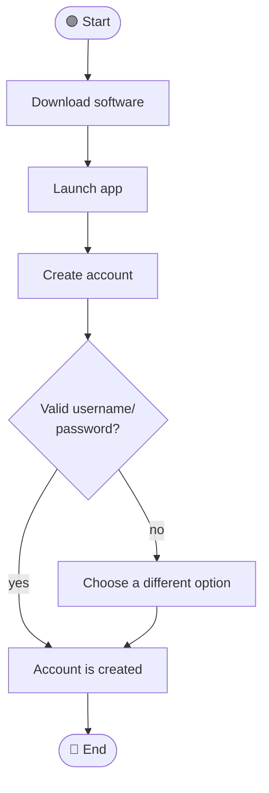

# UML diagram

```mermaid
flowchart TD
    Start([🟣 Start]) --> A[Download software]
    A --> B[Launch app]
    B --> C[Create account]
    C --> D{Valid username/\npassword?}
    D -- yes --> E[Account is created]
    D -- no --> F[Choose a different option]
    F --> E
    E --> End([🔵 End])
```
