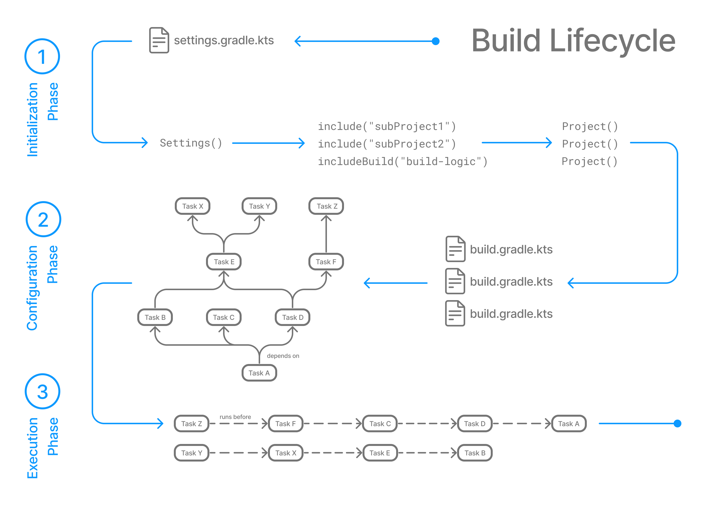

# Qu'est-ce que Gradle ?

Gradle est un **outil de build open-source** qui automatise les tâches répétitives du développement logiciel : compilation, tests, packaging, déploiement. Il est aujourd'hui l'outil de référence pour les projets Java, Kotlin et Android.

**Gradle** propose un langage de configuration expressif basé sur **Groovy** ou **Kotlin DSL**.

> [!tip] 
> Un **outil de build** est un programme qui transforme ton code source en une application prête à être exécutée ou distribuée. Il gère aussi les **dépendances** (bibliothèques externes) et orchestre les différentes étapes de construction du projet.

Concrètement, dans un projet, on écrit du code et **Gradle** s’occupe de **le compiler, tester et livrer automatiquement**. Il nous permet d'avoir des fichiers de build plus lisibles, maintenables et puissants.

---
## Langages et frameworks pris en charge

Gradle prend en charge **Android**, **C/C++**, **Scala**, **Java**, **Javascript**, **Groovy** et **Kotlin**.


---
# Les concepts clés

Avant de plonger dans la configuration, voici les termes que tu rencontreras dans toute la documentation :

- `build.gradle(kts)` : fichier de configuration principal du projet. Il déclare les plugins, dépendances et tâches.
- `compileJava, test, jar` : les tâches représentent des actions (compiler, tester, packager) et peuvent dépendre les unes des autres.
- `plugin java, spring boot` : extension qui ajoute des tâches et des conventions au projet.
- `dependencies { }` : bibliothèque déclarée avec un scope (`implementation`, `testImplementation`, etc.).

#### En pratique :

> un projet Gradle = **une liste de tâches + des dépendances entre elles**

### Exemple 

```java
// Déclaration des plugins
plugins {
	id("java")
	id("org.springframework.boot") version "3.2.0"
}

// Dépôt de téléchargement des bibliothèques
repositories {
	mavenCentral()
}

// Dépendances du projet
dependencies {
	implementation("org.springframework.boot:spring-boot-starter-web")
    testImplementation("org.springframework.boot:spring-boot-starter-test")
}
```

---
# Point forts

## Builds incrémentaux

Gradle ne compile que ce qui a changé, ce qui réduit drastiquement les temps de build.

> [!info] Exemple :
> Si on modifie une seule classe, **Gradle** ne recompilera pas tout le projet.

## Gestion des dépendances

Résolution automatique depuis **[Maven Central](https://central.sonatype.com/)** ou des dépôts privés.

> [!info] Exemple :
> On rajoute une ligne, **Gradle** télécharge et configure tout.

## Plugins riches

Écosystèmes de plugins pour **Spring Boot**, **Android**, **Docker**, **SonarQube** et bien d'autres...

Cas concret :
- plugin Spring Boot -> lancer ton app avec `./gradlew bootRun`
- plugin Docker -> générer une image automatiquement

## Multi-projets

Gère facilement des architectures mono-repo avec plusieurs modules indépendants.

Cas réel :

```
core → logique métier  
api → contrôleurs REST  
app → application principale   
```

---
# Aller plus loin

## Le cycle de vie d'un build Gradle (`Build Lifecyle`)

Le cycle de vie de la compilation est la séquence de phases que Gradle exécute pour transformer vos scripts de compilation en un travail finalisé, depuis l'initialisation de l'environnement de compilation jusqu'à la configuration des projets et enfin l'exécution des tâches.

### Phases de construction

Une compilation Gradle comporte trois phases distinctes.


Gradle exécute ces phases dans l'ordre :

### Phase 1 : Initialisation

**Gradle** prépare le projet :
- Il lit le fichier `settings.gralde`
- Il détecte les modules (projet principal + sous-projet)

> *Qu'est-ce que je dois builder ?*
### Phase 2 : Configuration

Gradle analyse la configuration :
- Il lit tous les `build.gradle`
- Il prépare les tâches (`build`, `test`, ...)
- Il détermine l'ordre d'exécution

> *"Comment je dois le builder ?"*
### Phase 3 : Exécution

Gradle fait le travail :
- Il exécute uniquement les tâches demandées ainsi que leurs dépendances

> *"Je lance le build"*

---
## Schéma du `Build Lifecyle`



Sources : https://docs.gradle.org/current/userguide/userguide.html
