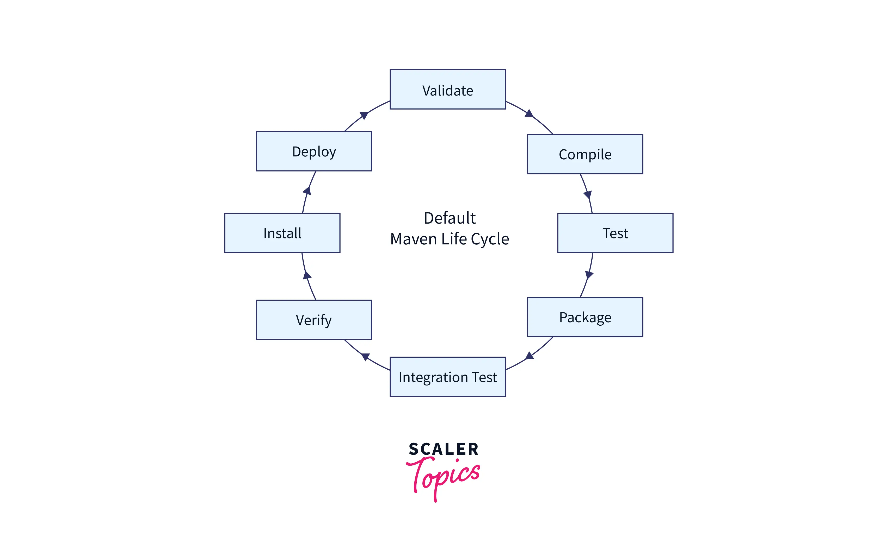

# Qu’est-ce que Maven ?

Maven, un mot yiddish signifiant _« accumulateur de connaissances »_ , a vu le jour dans le but de simplifier les processus de compilation du projet Jakarta Turbine. 

L'objectif principal de Maven est de permettre à un développeur d'organiser et de construire un projet Java dans les plus brefs délais. Il permet de :

- gérer les dépendances
- compiler le code
- exécuter les tests
- packager l’application (JAR, WAR…)
- standardiser la structure des projets

---
# Installation

Apache Maven peut être installé par la plupart des gestionnaires de paquets, ou manuellement en téléchargeant l'archive et en l'ajoutant à votre chemin d'accès.

Vous devez installer un kit de développement Java (JDK). Définissez la `JAVA_HOME` variable d'environnement sur le chemin d'accès à votre installation JDK ou placez le `java`fichier exécutable sur votre système `PATH`.

La version stable actuelle `3.9.15`requiert JDK 8 ou une version ultérieure, mais toute version récente fonctionnera parfaitement.

Lien téléchargement : https://maven.apache.org/download.cgi

1. Téléchargez l'archive Apache Maven

2. Extrayez l'archive de distribution dans n'importe quel répertoire. Utilisez `unzip apache-maven-3.9.15-bin.zip` ensuite la commande appropriée, `tar xzvf apache-maven-3.9.15-bin.tar.gz`selon l'archive.

3. Ajoutez le `bin`répertoire créé `apache-maven-3.9.15`à la `PATH`variable d'environnement

4. Vérifiez dans `mvn -v`une nouvelle invite de commandes. Le résultat devrait ressembler à ceci :

```
Apache Maven 3.9.15 (98b2cdbfdb5f1ac8781f537ea9acccaed7922349)
Maven home: /opt/apache-maven-3.9.15
Java version: 1.8.0_45, vendor: Oracle Corporation
Java home: /Library/Java/JavaVirtualMachines/jdk1.8.0_45.jdk/Contents/Home/jre
Default locale: en_US, platform encoding: UTF-8
OS name: "mac os x", version: "10.8.5", arch: "x86_64", family: "mac"
```

---
# Gestion des dépendances

## Le fichier `pom.xml`

C’est le **cœur du projet Maven** (Project Object Model).

### Exemple minimal :

```xml
<project xmlns="http://maven.apache.org/POM/4.0.0">
    <modelVersion>4.0.0</modelVersion>

    <groupId>com.example</groupId>
    <artifactId>mon-projet</artifactId>
    <version>1.0.0</version>

    <dependencies>
        <!-- Exemple de dépendance -->
        <dependency>
            <groupId>org.springframework</groupId>
            <artifactId>spring-core</artifactId>
            <version>6.0.0</version>
        </dependency>
    </dependencies>
</project>
```

Maven télécharge automatiquement les librairies depuis un repository (par défaut Maven Central).

Vous pouvez y accéder directement sur ce site pour faire votre sélection : https://mvnrepository.com/

Exemple :

```xml
<dependency>
    <groupId>org.junit.jupiter</groupId>
    <artifactId>junit-jupiter</artifactId>
    <version>5.10.0</version>
    <scope>test</scope>
</dependency>
```

---
## Les coordonnées Maven

Chaque projet/dépendance est identifié par :

|Scope|Usage|
|---|---|
|`compile`|par défaut, utilisé partout|
|`test`|uniquement pour les tests|
|`provided`|fourni par le serveur (ex: Tomcat)|
|`runtime`|nécessaire à l’exécution|

---
# Cycle de vie Maven

Les phases du cycle de vie Maven (par défaut) sont listées ci-dessous. Les commandes Maven déclencheront ces phases.

**Valider :** s'assurer que le projet est correct et que toutes les informations nécessaires sont disponibles.

**Compiler :** Cette commande compile le code source du projet.

**Tests :** Testez le code source compilé avec un framework de tests unitaires approprié. Ces tests ne doivent pas nécessiter de packaging ni de déploiement du code.

**Empaquetage :** Empaqueter le code compilé dans un format distribuable, tel qu’un **JAR** .

**Test d'intégration :** Traiter et déployer le package, si nécessaire, dans un environnement permettant d'effectuer des tests d'intégration.

**Vérification :** Effectuer les contrôles nécessaires pour s'assurer que le colis est valide et répond aux normes de qualité.

**Installation :** Installez le package dans le dépôt local afin que d'autres projets puissent le référencer.

**Déploiement :** Copiez le package finalisé dans le dépôt distant pour collaborer avec d’autres développeurs et projets dans un environnement d’intégration ou de publication.



---
# Commandes Maven

Voici quelques commandes Maven utiles :

|Commandes Maven|Description|
|---|---|
|mvn compile|Nous compilons le code source du projet à l'aide de la commande mvn compile .|
|mvn propre|La commande mvn clean permet de supprimer tous les fichiers des versions précédentes du projet.|
|test mvn|Nous exécutons les étapes de test du projet avec la commande mvn test .|
|mvn test-compile|Nous pouvons compiler le code source de test en utilisant la commande mvn test-compile .|
|mvn install|La commande mvn install facilite le déploiement de fichiers WAR ou JAR empaquetés en les stockant dans le dépôt local sous forme de classes.|
|package mvn|La commande mvn package génère un fichier WAR ou JAR pour le projet afin qu'il puisse être distribué.|
|mvn déployer|La commande mvn deploy est utilisée après la compilation, les tests et la génération du projet. Les fichiers WAR ou JAR ainsi créés sont copiés sur le dépôt distant afin que d'autres développeurs puissent les utiliser.|
