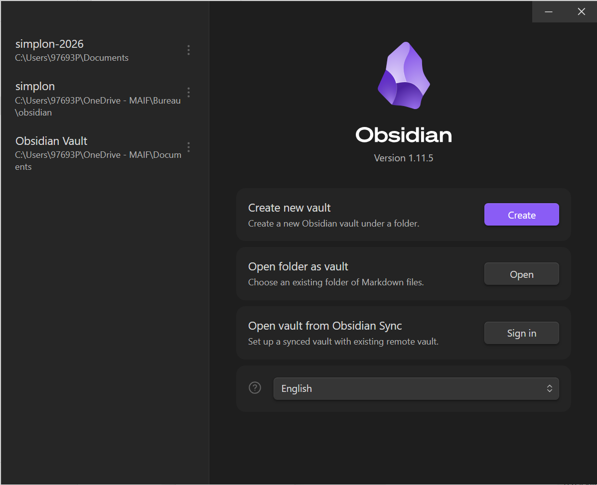
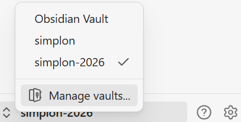

### Creation of your project

Above all, you have to clone your project in your computer (local workspace).
Open a terminal ( gitbash ), go to the directory in wich one you want clone the project. Then clone the project. rends toi dans le repertoire dans lequel ton projet sera cloner. Puis clone ton projet (repository):
```
git clone <url du projet>
```

Then go to the new directory
```
cd <nom du dossier>
```

Never work in the main branch. You should create a new branch to work in.
```
git branch <nom de la branch>
git checkout <nom de la branch>
```

To go faster
```
git checkout -b <nom de la branch>
```

this command create a new branch and go into.


When it done, open obsidian. Click on open and select your directory.




If you are already in a vault (obsidian automaticaly open your old worspace),
click on your current vault name in the bottom left side


then click on **manage vault**



This will open the same window as you start obsidian for the first time. Click on open folder as vault (open).

you are ready to work. Enjoy!
